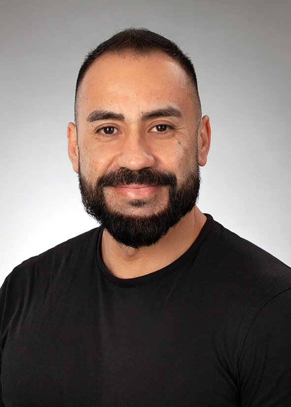
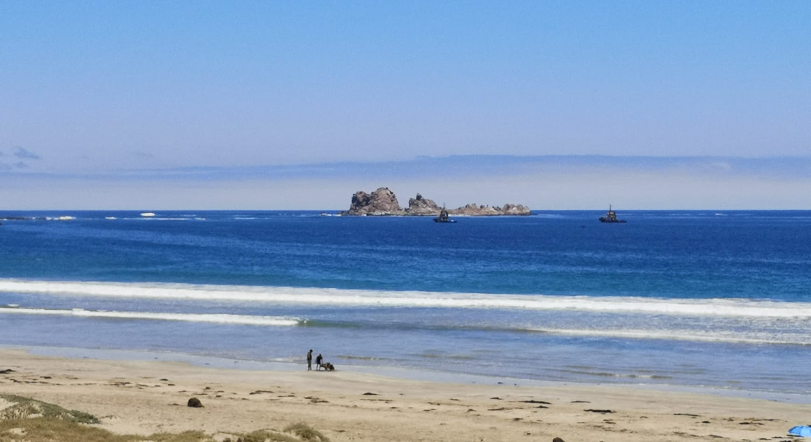

  

I am currently part of the [Chair of Optimization and Inverse Problems](https://www.imng.uni-stuttgart.de/de/institut/team/) at University of Stuttgart. Specifically, I am working in Bayesian inverse problems and scientific computation. Prior to this, I was a postdoctoral researcher at the [Chair of Spatial Data Science and Statistical Learning](https://uni-goettingen.de/en/629104.html) at Georg-August-Universität Göttingen. I also worked one year at the [Chair of Geoinformatics–Big Spatial Data](https://www.geoinformatics.uni-bayreuth.de/en/) at Bayreuth University.

My doctoral thesis was supervised by [Javier Contreras Reyes](https://www.researchgate.net/profile/Javier-Contreras-Reyes) and [Michael Karkulik](http://mkarkulik.mat.utfsm.cl/), where I proposed computational methods to incorporate smoothing thin plate splines into spatial models. During my doctoral studies, I completed two research internships: the first in the Probabilistic Machine Learning group at Aalto University, under the supervision of [Aki Vehtari](https://users.aalto.fi/~ave/); and the second in the Computer, Electrical, and Mathematical Sciences and Engineering Division at KAUST, under the supervision of [Paula Moraga](https://www.paulamoraga.com/). In addition to my academic experience, I have worked as a Data Scientist in the retail (Cencosud–Scotiabank) and forest (Arauco Celulosa) industries. I mainly use $\texttt{R}$, Template Model Builder ($\texttt{TMB}$), and $\texttt{Stan}$ to develop probabilistic models, but I am also interested in numerical methods (from a deterministic approach) for spatial models using $\texttt{Rcpp/RcppArmadillo}$.

Most of my life was in the beautiful Valparaíso. However (sorry to admit this), my favorite place in the world is **Los Vilos**!

