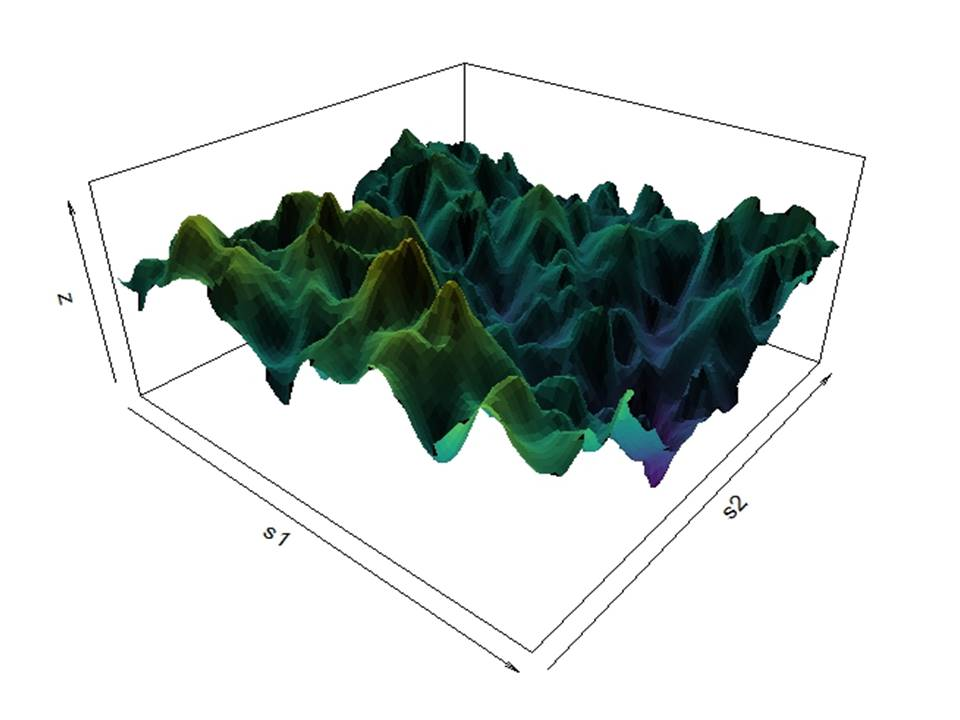

{width="569"}

# Introduction

Let us continue our understanding of the Kriging method. It is important to recall that while Kriging can be treated as a deterministic problem solvable through linear algebra, we are now shifting our focus to the more common (statistical) Bayesian perspective. The primary objective of Kriging is to utilize observed values $y_1, \dots, y_N$ sampled at spatial locations $\mathbf{s}_1, \dots, \mathbf{s}_N$ to predict an unknown value $y_{\text{new}}$ at a specific location $\mathbf{s}_{\text{new}}$ (where $\mathbf{s}_{\text{new}} \notin \{\mathbf{s}_1, \dots, \mathbf{s}_N\}$). In addition to the deterministic approach previously discussed, we can address this problem using stochastic and Bayesian frameworks. Under this view, we assume the data values $y_i$ are observed realizations $y(\mathbf{s}_i)$ of a random variable $Y(\mathbf{s}_i)$ belonging to a spatial random field $Y$. Since the collected data $y(\mathbf{s}_1), \dots, y(\mathbf{s}_N)$ represent only a single realization of the random variables $Y(\mathbf{s}_1), \dots, Y(\mathbf{s}_N)$, our predictions are formulated using these random variables as inputs. Consequently, the predictor $\hat{Y}(\mathbf{s})$ is itself a random variable. *Note: While our previous post used* $Z(\mathbf{s}_1), \dots, Z(\mathbf{s}_N)$ *to denote data values, we will now use* $Y(\mathbf{s}_1), \dots, Y(\mathbf{s}_N)$*. This change is strictly notational to help distinguish the stochastic approach from the deterministic one*.

# Random Fields

Let $(\Omega, \mathcal{F}, \mathbb{P})$ be a probability space. A function $Y:\Omega \to \mathbb{R}$ is called a \emph{random variable} if it is $\mathcal{F}/\mathcal{B}(\mathbb{R})$–measurable, where $\mathcal{B}(\mathbb{R})$ denotes the Borel $\sigma$–algebra on on $\mathbb{R}$. Now, in the same space of probability and $D\subseteq\mathbb{R}^d$ a domain in $d$ dimensions a stochastic process, or more appropriately in our context a **random field** $Y$ on $D$ is a collection of random variables $\{Y(\mathbf{s}) : \mathbf{s}\in D\}$, where for each fixed $\mathbf{s}\in D$, the mapping $[Y(\mathbf{s}):\Omega\to\mathbb{R} ]$ is a random variable. Thus, a random field is just a [a collection of random variables \[\@]{style="color:blue;"}cressie1993spatial[\]]{style="color:blue;"}. Now, the *moments* of a random field $Y$ provide useful information, for example; the mean of a random field Y can be defined as:

\begin{equation}
\mu(\mathbf{s}) = \mathbb{E}[Y(\mathbf{s})], \qquad \mathbf{s} \in D,
\end{equation}

provided the expectation exists for all $\mathbf{s} \in D$. The second central moment of the random field $Y$ (variance) is given by:

\begin{equation}
\operatorname{Var}(Y(\mathbf{s})) = \mathbb{E}\!\left[(Y(\mathbf{s})  - \mu(\mathbf{s}))^2\right],
\qquad \mathbf{s} \in D,
\end{equation}

where $\mu(\mathbf{s}) = \mathbb{E}[Y(\mathbf{s})]$ is the mean function previously defined. And, in general, the covariance $\mathbf{C}$ of the random field $Y$ is defined as:

\begin{equation}
\sigma^2 \mathbf{C}(\mathbf{s}, \mathbf{s'}) = \operatorname{Cov}(Y(\mathbf{s}), Y(\mathbf{s'}))
= \mathbb{E}\!\left[(Y(\mathbf{s}) - \mu(\mathbf{s}))
(Y(\mathbf{s'}) - \mu(\mathbf{s'}))\right],
\quad \mathbf{s},\mathbf{s'}\in D.
\end{equation}

where the scalar parameter $\sigma^2$ is known as the process variance. In the statistics literature this parameter is often included in the definition of the covariance function. For example, for a Gaussian covariance, $\mathbf{C}(\mathbf{s}, \mathbf{s'}) = \sigma^2\exp\left(-\frac{(x - x')^2}{2\ell^2}\right)$, however in the numerical analysis texts they don't include this "amplification" factor. The reason is that in the deterministic/numerical analysis setting of scattered data interpolation, that factor is irrelevant since it will be absorbed in the expantions coefficients @fasshahuer2015kernel. However, in stochastics methods the variance process $\sigma^2$ plays an important role. Thus, considering this, the variance of the random field $Y$ is the diagonal of the covariance

\begin{equation} 
\operatorname{Var}(Y) = \sigma^2 \mathbf{C}(\mathbf{s}, \mathbf{s'})
\end{equation}

There are different kinds of spatial fields (spatial stochastic processes) but we will be interested in the called *Gaussian random fields (or also known as Gaussian processes).*


# Gaussian Random Field and Kriging


## Gaussian Random Field

Among all types of spatial random fields, we focus on **Gaussian Random Field (GRF)**. A random field $Y$ on $D \subseteq \mathbb{R}^d$ is called a Gaussian random field if, for any finite collection of locations $\mathbf{s}_1, \dots, \mathbf{s}_n \in D$, the joint distribution of $(Y(\mathbf{s}_1), \dots, Y(\mathbf{s}_n))^\top$ is multivariate Gaussian:

$$
\begin{pmatrix} Y(\mathbf{s}_1) \\ \vdots \\ Y(\mathbf{s}_n) \end{pmatrix}
\sim \mathcal{N}\!\left(\boldsymbol{\mu},\, \boldsymbol{\Sigma}\right),
$$

where $\boldsymbol{\mu} = (\mu(\mathbf{s}_1), \dots, \mu(\mathbf{s}_n))^\top$ is the mean vector and $\boldsymbol{\Sigma}$ is the $n \times n$ covariance matrix with entries $\Sigma_{ij} = \sigma^2 \mathbf{C}(\mathbf{s}_i, \mathbf{s}_j)$.

A GRF is therefore entirely characterized by its **mean function** $\mu(\mathbf{s})$ and **covariance function** $\sigma^2 \mathbf{C}(\mathbf{s}, \mathbf{s}')$. We write $Y \sim \mathcal{GP}(\mu, \sigma^2 \mathbf{C})$ to denote this.

---

## Stationarity

A GRF is called **second-order stationary** (or **weakly stationary**) if:

1. The mean is constant: $\mu(\mathbf{s}) = \mu$ for all $\mathbf{s} \in D$.
2. The covariance depends only on the difference $\mathbf{h} = \mathbf{s} - \mathbf{s}'$:

$$
\operatorname{Cov}(Y(\mathbf{s}),\, Y(\mathbf{s}')) = \sigma^2 \mathbf{C}(\mathbf{s} - \mathbf{s}') = \sigma^2 \mathbf{C}(\mathbf{h}).
$$

If the covariance depends only on the Euclidean distance $\|\mathbf{h}\|$ (and not on the direction), the field is called **isotropic**:

$$
\operatorname{Cov}(Y(\mathbf{s}),\, Y(\mathbf{s}')) = \sigma^2 \mathbf{C}(\|\mathbf{s} - \mathbf{s}'\|).
$$

Under isotropy, the covariance is a function only of the scalar distance $r = \|\mathbf{h}\|$, which greatly simplifies modeling and inference. We will assume isotropy throughout.

---

## The Matérn Covariance Family

A flexible and widely used family of isotropic covariance functions is the **Matérn class**, defined as:

$$
\mathbf{C}(r;\, \nu,\, \ell) = \frac{2^{1-\nu}}{\Gamma(\nu)} \left(\frac{\sqrt{2\nu}\, r}{\ell}\right)^{\!\nu} K_\nu\!\left(\frac{\sqrt{2\nu}\, r}{\ell}\right), \qquad r \geq 0,
$$

where $r = \|\mathbf{s} - \mathbf{s}'\|$ is the Euclidean distance, $\ell > 0$ is the **range** (or length-scale) parameter controlling how quickly correlations decay with distance, $\nu > 0$ is the **smoothness** parameter governing the mean-square differentiability of the field, and $K_\nu$ is the modified Bessel function of the second kind of order $\nu$.

Two notable special cases arise for half-integer values of $\nu$:

- **$\nu = 1/2$** (exponential covariance): $\mathbf{C}(r) = \exp\!\left(-r/\ell\right)$, giving a continuous but not differentiable field.
- **$\nu = 3/2$**: $\mathbf{C}(r) = \left(1 + \frac{\sqrt{3}\,r}{\ell}\right)\exp\!\left(-\frac{\sqrt{3}\,r}{\ell}\right)$, giving a once mean-square differentiable field.
- **$\nu \to \infty$** (squared exponential / Gaussian): $\mathbf{C}(r) = \exp\!\left(-r^2 / 2\ell^2\right)$, giving an infinitely differentiable field.

The choice of $\nu$ encodes prior beliefs about the regularity of the spatial phenomenon being modeled. In practice, $\nu = 1$ or $\nu = 3/2$ are common choices that balance realism with computational tractability.

---

## Kriging as Bayesian Prediction

We now frame spatial prediction within the Bayesian paradigm. Suppose we have observations $\mathbf{y} = (y(\mathbf{s}_1), \dots, y(\mathbf{s}_N))^\top$ collected at locations $\mathbf{s}_1, \dots, \mathbf{s}_N$, and we wish to predict the unknown value $Y(\mathbf{s}_*)$ at a new location $\mathbf{s}_*$.

We adopt the following hierarchical model:

$$
\begin{aligned}
Y(\mathbf{s}) &= \mu + U(\mathbf{s}), \qquad U \sim \mathcal{GP}(0,\, \sigma^2 \mathbf{C}), \\
y(\mathbf{s}_i) &= Y(\mathbf{s}_i) + \varepsilon_i, \qquad \varepsilon_i \overset{\text{iid}}{\sim} \mathcal{N}(0,\, \sigma_e^2),
\end{aligned}
$$

where $\mu$ is a constant mean, $U(\mathbf{s})$ is the zero-mean latent Gaussian field with variance $\sigma^2$ and correlation function $\mathbf{C}$, and $\varepsilon_i$ is independent measurement noise with variance $\sigma_e^2$ (the **nugget**).

The joint distribution of the observations $\mathbf{y}$ and the prediction target $Y_* = Y(\mathbf{s}_*)$ is multivariate Gaussian:

$$
\begin{pmatrix} \mathbf{y} \\ Y_* \end{pmatrix}
\sim \mathcal{N}\!\left(
\begin{pmatrix} \mu \mathbf{1} \\ \mu \end{pmatrix},\;
\begin{pmatrix} \sigma^2 \mathbf{C}(\mathbf{S}, \mathbf{S}) + \sigma_e^2 \mathbf{I} & \sigma^2 \mathbf{c}_* \\ \sigma^2 \mathbf{c}_*^\top & \sigma^2 \end{pmatrix}
\right),
$$

where $\mathbf{C}(\mathbf{S}, \mathbf{S})$ is the $N \times N$ matrix with $(i,j)$ entry $\mathbf{C}(\mathbf{s}_i, \mathbf{s}_j)$, and $\mathbf{c}_* = (\mathbf{C}(\mathbf{s}_1, \mathbf{s}_*), \dots, \mathbf{C}(\mathbf{s}_N, \mathbf{s}_*))^\top$ is the vector of cross-covariances between observations and the prediction site.

### The Kriging Equations

By the standard formula for the conditional distribution of a multivariate Gaussian, the posterior distribution of $Y_*$ given the observations $\mathbf{y}$ is:

$$
\boxed{Y_* \mid \mathbf{y} \sim \mathcal{N}\!\left(\hat{y}_*, \, \sigma^2_*\right),}
$$

with **Kriging mean** (the optimal linear unbiased predictor):

$$
\hat{y}_* = \mu + \sigma^2 \mathbf{c}_*^\top \boldsymbol{\Sigma}_{\mathbf{y}}^{-1} (\mathbf{y} - \mu \mathbf{1}),
$$

and **Kriging variance** (posterior uncertainty):

$$
\sigma^2_* = \sigma^2 - \sigma^2 \mathbf{c}_*^\top \boldsymbol{\Sigma}_{\mathbf{y}}^{-1} \sigma^2 \mathbf{c}_*,
$$

where $\boldsymbol{\Sigma}_{\mathbf{y}} = \sigma^2 \mathbf{C}(\mathbf{S}, \mathbf{S}) + \sigma_e^2 \mathbf{I}$ is the observation covariance matrix.

Several key properties follow immediately:

1. **At observation locations**: if $\sigma_e^2 = 0$ (no nugget), the Kriging mean interpolates exactly, i.e.\ $\hat{y}_{\mathbf{s}_i} = y(\mathbf{s}_i)$, and the Kriging variance collapses to zero.
2. **Far from data**: as $\|\mathbf{s}_* - \mathbf{s}_i\| \to \infty$ for all $i$, the cross-covariance $\mathbf{c}_* \to \mathbf{0}$, so $\hat{y}_* \to \mu$ and $\sigma^2_* \to \sigma^2$ — the prediction reverts to the prior mean with full prior variance.
3. **Uncertainty is data-geometry dependent**: $\sigma^2_*$ depends only on the locations $\mathbf{s}_1, \dots, \mathbf{s}_N$ and $\mathbf{s}_*$, not on the observed values $\mathbf{y}$. Regions densely observed have low uncertainty; regions far from data retain high uncertainty.

### Practical Computation via Cholesky

Directly inverting $\boldsymbol{\Sigma}_{\mathbf{y}}$ is numerically unstable. In practice, we use the **Cholesky decomposition** $\boldsymbol{\Sigma}_{\mathbf{y}} = \mathbf{L}\mathbf{L}^\top$ to solve the linear system efficiently. Defining the Kriging weights vector $\boldsymbol{\alpha} = \boldsymbol{\Sigma}_{\mathbf{y}}^{-1}(\mathbf{y} - \mu\mathbf{1})$ via two triangular solves:

$$
\mathbf{L}\mathbf{v} = \mathbf{y} - \mu\mathbf{1}, \quad \mathbf{L}^\top \boldsymbol{\alpha} = \mathbf{v},
$$

the Kriging mean and variance for all prediction sites $\{\mathbf{s}_*^{(k)}\}$ become:

$$
\hat{y}_* = \mu + \sigma^2 \mathbf{c}_*^\top \boldsymbol{\alpha}, \qquad
\sigma^2_* = \sigma^2 - \|\mathbf{L}^{-1}(\sigma^2 \mathbf{c}_*)\|^2.
$$

This approach reduces the computational cost from $\mathcal{O}(N^3)$ per prediction site to a single $\mathcal{O}(N^3)$ factorization followed by $\mathcal{O}(N)$ solves per prediction point.


# R code 

Next, there is an R code to simulated spatial data and then using Kriging for interpolation purposes. 


```{r}
#======================================================
# Kriging with Matérn covariance
# Simulate a GRF, fit (known parameters), predict on a
# regular grid, and visualise results.
#======================================================
library(ggplot2)
library(gridExtra)

set.seed(42)


# Initial "true" Parameters
N_s     <- 80        # number of observation locations
range   <- 0.25      # Matérn spatial range (length-scale range)
nu      <- 1         # Matérn smoothness parameter
sigma_u <- 1.0       # latent field marginal SD
sigma_e <- 0.15      # measurement error SD (nugget)
mu_true <- 0.0       # constant mean      


# Helper Matérn covariance function
matern_cov <- function(coords1, coords2 = NULL, nu = 1, range, sigma2 = 1) {
  if (is.null(coords2)) coords2 <- coords1
  n1 <- nrow(coords1); n2 <- nrow(coords2)
  # Euclidean distance matrix between the two sets of points
  D  <- as.matrix(dist(rbind(coords1, coords2)))[1:n1, (n1+1):(n1+n2), drop = FALSE]
  D[D == 0] <- 1e-10        # avoid exact zeros before Bessel evaluation
  s  <- sqrt(2 * nu) * D / range
  C  <- (2^(1-nu)) / gamma(nu) * s^nu * besselK(s, nu)
  # Enforce unit variance on the diagonal (same set of points)
  if (n1 == n2 && isTRUE(all.equal(coords1, coords2))) diag(C) <- 1
  sigma2 * C
}

# Simulate observation locations  (uniform in [0,1]²)
obs_locs <- matrix(runif(N_s * 2), ncol = 2,
            dimnames = list(NULL, c("s1", "s2")))


# Build the latent covariance matrix and simulate
# the true field U(s) via Cholesky factorisation
Sigma_U <- matern_cov(obs_locs, nu = nu, range = range, sigma2 = sigma_u^2)
# Small jitter on the diagonal for numerical stability
diag(Sigma_U) <- diag(Sigma_U) + 1e-9
L_U    <- t(chol(Sigma_U))        # lower-triangular Cholesky factor
U_true <- as.vector(L_U %*% rnorm(N_s))   # one realisation of the latent field


# Add measurement noise epsilon
y_obs <- mu_true + U_true + rnorm(N_s, sd = sigma_e)


#=========================================================
# Kriging — build the observation covariance matrix
#======================================================
Sigma_y <- Sigma_U + sigma_e^2 * diag(N_s)
diag(Sigma_y) <- diag(Sigma_y) + 1e-9
L_obs  <- t(chol(Sigma_y))

alpha <- backsolve(t(L_obs), forwardsolve(L_obs, y_obs - mu_true))

# Build a 30 × 30 regular grid for prediction/interpolation
N_grid    <- 30
pred_grid <- as.matrix(expand.grid(s1 = seq(0, 1, length.out = N_grid),
                       s2 = seq(0, 1, length.out = N_grid)))
N_pred <- nrow(pred_grid)

# Kriging prediction at each grid point

# Cross-covariance matrix: N_pred × N_obs
C_cross <- matern_cov(pred_grid, obs_locs, nu = nu, range = range, sigma2 = sigma_u^2)

# Kriging mean  (vectorised over all prediction sites)
krig_mean <- mu_true + as.vector(C_cross %*% alpha)

# Kriging SD via forward-solve:  V = L_obs⁻¹ (C_cross^T)
V <- forwardsolve(L_obs, t(C_cross))  # N_obs × N_pred
krig_var <- pmax(sigma_u^2 - colSums(V^2), 0)
krig_sd  <- sqrt(krig_var)

cat(sprintf("\nKriging mean range : [%.3f, %.3f]\n", min(krig_mean), max(krig_mean)))
cat(sprintf("Kriging SD  range  : [%.4f, %.4f]\n",   min(krig_sd),  max(krig_sd)))


#==========================
# Plots
#==========================

# Shared colour limits (mean / true field)
val_lim <- range(c(U_true, y_obs, krig_mean))

# Data frames for ggplot
obs_df <- data.frame(s1 = obs_locs[, "s1"],
                     s2 = obs_locs[, "s2"],
                     U  = U_true,
                     y  = y_obs)

pred_df <- data.frame(s1   = pred_grid[, "s1"],
                      s2   = pred_grid[, "s2"],
                      mean = krig_mean,
                      sd   = krig_sd)

# p_true: latent field at observation locations
p_true <- ggplot(obs_df, aes(s1, s2, colour = U)) +
  geom_point(size = 3.5) +
  scale_colour_distiller(palette = "RdBu", direction = -1,
                         limits = val_lim,
                         name = expression(U(bold(s)))) +
  coord_equal() +
  theme_bw(base_size = 11) +
  theme(panel.grid = element_blank()) +
  labs(title    = "True latent field  U(s)",
       subtitle = bquote(sigma == .(sigma_u) ~ "  range =" ~ .(range) ~
                           "  " * nu == .(nu)),
       x = expression(s[1]), y = expression(s[2]))

# observations  y 
p_obs <- ggplot(obs_df, aes(s1, s2, colour = y)) +
  geom_point(size = 3.5) +
  scale_colour_distiller(palette = "RdBu", direction = -1,
                         limits = val_lim,
                         name = expression(y(bold(s)))) +
  coord_equal() +
  theme_bw(base_size = 11) +
  theme(panel.grid = element_blank()) +
  labs(title    = "Observations  y(s)",
       subtitle = bquote(sigma[e] == .(sigma_e)),
       x = expression(s[1]), y = expression(s[2]))

# Kriging mean  
p_krig_mean <- ggplot(pred_df, aes(s1, s2, fill = mean)) +
  geom_raster() +
  geom_point(data = obs_df, aes(s1, s2),
             inherit.aes = FALSE, colour = "black", size = 1.2) +
  scale_fill_distiller(palette = "RdBu", direction = -1,
                       limits = val_lim,
                       name = expression(hat(y)(bold(s)["*"]))) +
  coord_equal() +
  theme_bw(base_size = 11) +
  theme(axis.text  = element_blank(),
        axis.ticks = element_blank(),
        panel.grid = element_blank()) +
  labs(title    = "Kriging mean",
       subtitle = "Black points = observation locations",
       x = NULL, y = NULL)

# Kriging SD  
p_krig_sd <- ggplot(pred_df, aes(s1, s2, fill = sd)) +
  geom_raster() +
  geom_point(data = obs_df, aes(s1, s2),
             inherit.aes = FALSE, colour = "black", size = 1.2) +
  scale_fill_distiller(palette = "YlOrRd", direction = 1,
                       limits = c(0, NA),
                       name = expression(sigma["*"](bold(s)["*"]))) +
  coord_equal() +
  theme_bw(base_size = 11) +
  theme(axis.text  = element_blank(),
        axis.ticks = element_blank(),
        panel.grid = element_blank()) +
  labs(title    = "Kriging uncertainty (posterior SD)",
       x = NULL, y = NULL)

# Arrange the plots
grid.arrange(p_true, p_obs, ncol = 2)
grid.arrange(p_krig_mean, p_krig_sd, ncol = 2)

```

